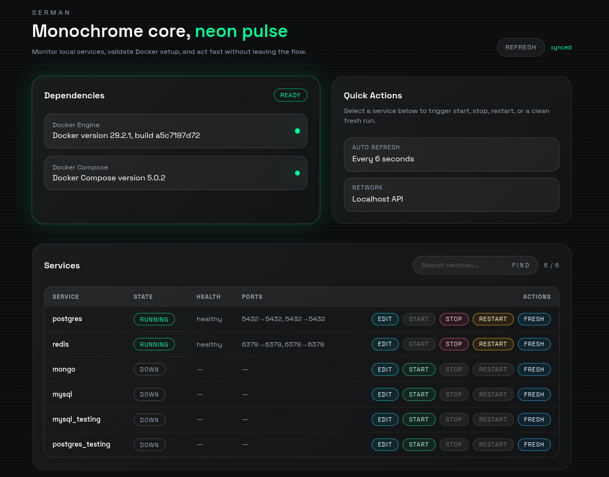
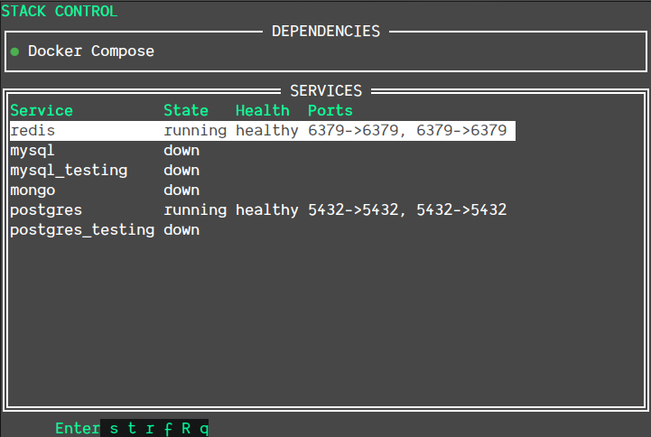

# serman

`serman` is a local infrastructure manager for development stacks built on Docker Compose. It gives you two interfaces over the same service set:

- a web UI for fast day-to-day service control
- a terminal UI for keyboard-driven workflows

The project manages common local dependencies such as Redis, MySQL, MongoDB, and PostgreSQL, including separate testing variants where needed.

## Preview

### Web UI



### Terminal UI



## What It Does

- Starts, stops, restarts, and recreates local services
- Shows live service state, health, and published ports
- Edits service config from the project `.env`
- Supports both a web UI and a TUI
- Runs the web UI in the background with `start`, `stop`, and `status`
- Uses Compose fragments from [`services/`](./services)

## Managed Services

Current built-in services:

- `redis`
- `mysql`
- `mysql_testing`
- `mongo`
- `postgres`
- `postgres_testing`

Service definitions are declared in [internal/serman/services.go](./internal/serman/services.go).

## Project Layout

- [cmd/web/main.go](./cmd/web/main.go): web server and web command entrypoint
- [cmd/serman/main.go](./cmd/serman/main.go): terminal UI
- [services/](./services): Docker Compose fragments
- [web/](./web): Vue frontend
- [.env.example](./.env.example): starter environment values

## Requirements

You need:

- Docker
- Docker Compose v2
- Go 1.24+
- Node.js and npm for building the web frontend

## Quick Start

1. Copy the environment file:

```bash
cp .env.example .env
```

2. Build the web frontend:

```bash
cd web
npm install
npm run build
cd ..
```

3. Build the binaries:

```bash
GOCACHE=/tmp/go-build-web go build -o serman-web ./cmd/web
GOCACHE=/tmp/go-build-tui go build -o serman-tui ./cmd/serman
```

4. Start the web UI in the background:

```bash
./serman-web start
```

5. Open the UI:

```text
http://localhost:8080
```

## Build Commands

Build the web binary:

```bash
GOCACHE=/tmp/go-build-web go build -o serman-web ./cmd/web
```

Build the TUI binary:

```bash
GOCACHE=/tmp/go-build-tui go build -o serman-tui ./cmd/serman
```

## Web Commands

`serman-web` supports command-style usage:

```bash
./serman-web start
./serman-web stop
./serman-web status
./serman-web help
```

Behavior:

- `start`: runs the web UI in the background
- `stop`: stops the running background server
- `status`: shows whether it is running
- `help`: prints command usage

Runtime files:

- PID file: [.serman/serman-web.pid](./.serman/serman-web.pid)
- Log file: [.serman/serman-web.log](./.serman/serman-web.log)

If browser auto-open works in your desktop environment, `serman-web` will try to open `http://localhost:8080` automatically.

## TUI Usage

Run the terminal UI:

```bash
./serman-tui
```

Keyboard shortcuts:

- `Enter`: edit selected service config
- `e`: edit selected service config
- `s`: start service
- `t`: stop service
- `r`: restart service
- `f`: fresh recreate service
- `R`: refresh status
- `q`: quit

## Web UI Features

The web UI currently includes:

- dependency checks for Docker and Compose
- services table with state, health, and ports
- action buttons with state-aware disabling
- search across service name, state, health, and ports
- inline config editor backed by `.env`

## Configuration

Configuration lives in [.env](./.env). If it does not exist, create it from [.env.example](./.env.example).

Example:

```env
NAMESPACE=services

REDIS_PORT=6379
REDIS_PASSWORD=password

MYSQL_PORT=3306
MYSQL_DATABASE="${NAMESPACE}-db"
MYSQL_USER="${NAMESPACE}-user"
MYSQL_PASSWORD=password
MYSQL_ROOT_PASSWORD=password

MONGODB_PORT=27017
MONGODB_DATABASE="${NAMESPACE}-db"
MONGODB_USERNAME="${NAMESPACE}-user"
MONGODB_PASSWORD=password

POSTGRES_PORT=5432
POSTGRES_DB="${NAMESPACE}-db"
POSTGRES_USER="${NAMESPACE}-user"
POSTGRES_PASSWORD=password
```

Important:

- `NAMESPACE` must be set, or Compose names will be invalid
- service actions load `.env` explicitly from the repo root
- config edits in the web UI and TUI both write back to `.env`

## Compose Model

This project uses multiple Compose fragments from [services/](./services) instead of a single large file.

Examples:

- [services/00-base.yaml](./services/00-base.yaml)
- [services/redis.yaml](./services/redis.yaml)
- [services/mysql.yaml](./services/mysql.yaml)
- [services/mongo.yaml](./services/mongo.yaml)
- [services/postgres.yaml](./services/postgres.yaml)

The web and TUI layers assemble these fragments dynamically when calling Docker Compose.

## Local Extra Services

If you want to add extra services without committing them, put additional Compose fragments in `services/local/`.

- files in `services/` remain tracked project defaults
- files in `services/local/` are loaded automatically by `serman`
- `services/local/` is ignored by git

Example:

```text
services/
  00-base.yaml
  redis.yaml
  local/
    mailhog.yaml
```

Any `*.yaml` file in `services/local/` can define extra services, volumes, or other Compose fragments for your machine only.

## Fresh Recreate

`fresh` is intended for resetting a service and recreating it cleanly.

Behavior:

- stops the service
- removes the service container
- removes declared persistent volumes when relevant
- starts the service again

Testing services are designed to be ephemeral and use `tmpfs` where appropriate.

## Development

Run the web frontend in dev mode:

```bash
cd web
npm install
npm run dev
```

Run the web backend directly in foreground mode:

```bash
go run ./cmd/web serve
```

Run the TUI directly:

```bash
go run ./cmd/serman
```

## Operational Notes

### PostgreSQL 18+

PostgreSQL 18 images expect data under `/var/lib/postgresql`, not the old `/var/lib/postgresql/data` mount layout.

This repo has already been updated for that layout, but if you created volumes with an older version of the service definition, you may need to remove and recreate the old PostgreSQL volume if you do not need the data.

### Browser Auto-Open

The web binary tries several Linux launchers:

- `xdg-open`
- `gio open`
- `sensible-browser`

If none of them work in your session, open the URL manually.

### Port Binding in Restricted Environments

If `:8080` cannot be bound, the web server will fail to start. This is usually an environment restriction, not an application bug.

## Troubleshooting

### `NAMESPACE` is empty

Symptom:

```text
Invalid container name (-postgres)
```

Cause:

- `.env` is missing
- `NAMESPACE` is blank

Fix:

```bash
cp .env.example .env
```

Then confirm:

```bash
grep '^NAMESPACE=' .env
```

### PostgreSQL fails after image upgrade

Symptom:

```text
data in /var/lib/postgresql/data (unused mount/volume)
```

Cause:

- old volume layout with newer PostgreSQL image

Fix:

- migrate the data correctly, or
- remove the old volume and recreate the container if the data is disposable

### Web status works but no browser opens

Check:

```bash
./serman-web status
cat .serman/serman-web.log
```

Then open:

```text
http://localhost:8080
```

## License

This project is licensed under the MIT License. See [LICENSE](./LICENSE).
